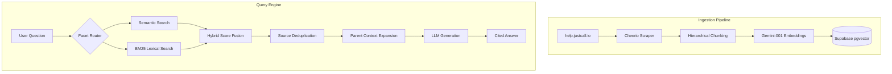

# JustCall Help — Production-Grade RAG Search

> Intelligent, citation-backed question-answering over [JustCall](https://justcall.io) help documentation. Built with hybrid retrieval, hierarchical chunking, and LLM-powered answer generation.

**Live:** [ragie-eight.vercel.app](https://ragie-eight.vercel.app/)

---

## 🚀 Key Features

- **Hybrid Retrieval:** Combines semantic vector search (Gemini) with lexical BM25 search for superior accuracy.
- **Hierarchical Chunking:** Uses a parent-child strategy to maintain broad context while performing precise retrieval.
- **Facet-Aware Routing:** Intelligently routes queries to specific knowledge domains (e.g., Core Support, JustCall Email) using LLM classification.
- **Deduplication & Diversity:** Implements database-level unique constraints and source-based reranking to ensure a diverse set of results without redundancy.
- **Citation Discipline:** Enforces strict inline citations (`[#1]`, `[#2]`) to ensure answers are grounded in retrieved context.
- **Observability:** Integrated with Langfuse for tracing retrieval pipelines and monitoring LLM performance.

---

## 🏗️ Architecture



### Retrieval Deep Dive

| Stage | Mechanism | Purpose |
|-------|-----------|---------|
| **Facet Routing** | LLM-based classification | Narrows the search space to relevant document categories. |
| **Semantic Search** | Vector similarity (Cosine) | Captures conceptual meaning even when keywords don't match. |
| **Lexical Search** | BM25 over content tokens | Finds precise matches for technical terms and product names. |
| **Hybrid Scoring** | Weighted Fusion + Intent Adjustment | Balanced ranking using semantic, lexical, and metadata signals. |
| **Deduplication** | Source-level filtering | Ensures no single article dominates the results (max 2 chunks per source). |

---

## 🛠️ Tech Stack

- **Framework:** Next.js 15 (App Router) + React 19
- **Styling:** Tailwind CSS 4 + shadcn/ui
- **Embeddings:** Google Gemini (`text-embedding-004`)
- **LLM:** Groq (Llama 3.3 70B) or Google Gemini 2.0 Flash
- **Vector Store:** Supabase (PostgreSQL + pgvector)
- **Local State:** SQLite (`better-sqlite3`) for ingestion progress tracking
- **Observability:** Langfuse

---

## ⚙️ Setup & Deployment

### 1. Database Configuration
Run the provided `setup.sql` in your Supabase SQL Editor to initialize the schema, enable `pgvector`, and create the necessary functions and indexes (including the deduplication index).

### 2. Environment Variables
Create a `.env` file with the following keys:

```env
# AI Providers
GEMINI_API_KEY=           # Required for embeddings and/or chat
GROQ_API_KEY=             # Required if CHAT_PROVIDER=groq
CHAT_PROVIDER=groq        # "groq" or "gemini"

# Supabase
SUPABASE_URL=             # Your project URL
SUPABASE_SERVICE_ROLE_KEY= # Service role key for ingestion

# Optional Tuning
RAG_TOP_K=5               # Chunks to send to LLM
RAG_CANDIDATE_K=20        # Candidates for hybrid reranking
RAG_DISABLE_LLM_ROUTER=0  # Set to 1 for keyword-only routing
```

### 3. Ingestion
```bash
npm install
npm run ingest                # Incremental ingestion (skips unchanged articles)
npm run ingest:reset-and-run  # Clear and re-ingest everything
```

### 4. Running the App
```bash
npm run dev                   # Local development server
```

---

## 🛡️ Handling Duplication

This repository handles duplication at three levels:
1. **Scraping Level:** Uses a local SQLite `progress.db` to store checksums of scraped articles, skipping those that haven't changed.
2. **Database Level:** A unique index in Supabase on `(metadata->>'source', md5(content))` prevents duplicate chunks from being stored.
3. **Retrieval Level:** The `query.js` pipeline filters out redundant chunks from the same source to provide a more diverse set of citations to the LLM.

---

## 🧪 Evaluation & Quality

Run the evaluation suite to measure retrieval accuracy and answer quality:
```bash
npm run eval         # Standard evaluation
npm run eval:strict  # Fail on any check failure
```
