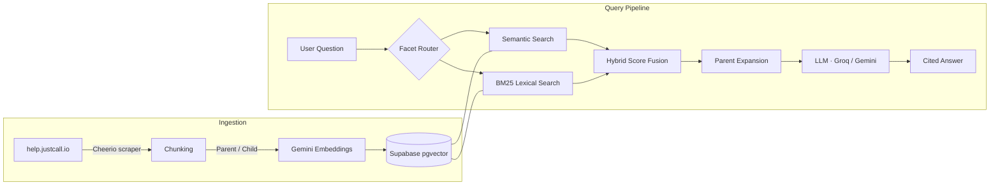

# JustCall Help — RAG Search

> Intelligent question-answering over [JustCall](https://justcall.io) help documentation, powered by hybrid retrieval and LLM-generated answers with citations.

**Live:** [ragie-eight.vercel.app](https://ragie-eight.vercel.app/)

---

## Architecture



## Tech Stack

| Layer | Technology |
|-------|-----------|
| Framework | Next.js 15 + React 19 |
| UI | shadcn/ui + Tailwind CSS 4 |
| LLM | Groq (Llama 3.3 70B) or Google Gemini |
| Embeddings | Google Gemini |
| Vector Store | Supabase (pgvector) |
| Ingestion | Cheerio scraper + hierarchical chunking |

---

## How It Works

1. **Ingest** — Scrapes help articles from help.justcall.io, splits them into parent/child chunks, generates embeddings, and stores them in Supabase.
2. **Query** — Runs semantic search, BM25 lexical search, and facet routing in parallel, then fuses scores to rank the best chunks.
3. **Answer** — Top chunks are sent to the LLM with a system prompt that enforces citation discipline (`[#1]`, `[#2]`, etc.).

### Retrieval Pipeline

| Stage | Detail |
|-------|--------|
| Facet routing | LLM or keyword-based classification into facets (core, email) |
| Semantic search | Vector similarity via Supabase `match_documents` |
| Lexical search | BM25 scoring over extracted query terms |
| Hybrid scoring | Weighted fusion — semantic (0.6), BM25 (0.4), intent signals, facet boost |
| Parent expansion | Fetches parent chunks for broader context |
| Citation enforcement | Ensures the answer cites retrieved sources |

## Getting Started

### Prerequisites

- Node.js 20+
- A Supabase project with pgvector enabled
- API keys for Gemini and/or Groq

### Environment Variables

Create a `.env` file:

```env
GEMINI_API_KEY=           # Required — used for embeddings (and LLM if provider is gemini)
SUPABASE_URL=             # Required — Supabase project URL
SUPABASE_SERVICE_ROLE_KEY= # Required — Supabase service role key
GROQ_API_KEY=             # Required when CHAT_PROVIDER=groq

# Optional
CHAT_PROVIDER=groq        # "groq" (default) or "gemini"
GROQ_MODEL=llama-3.3-70b-versatile
GEMINI_CHAT_MODEL=gemini-2.0-flash
RAG_TOP_K=5               # Final results returned
RAG_CANDIDATE_K=20        # Candidates before reranking
RAG_DISABLE_LLM_ROUTER=0  # Set to 1 to use keyword routing only
```

### Install & Run

```bash
npm install
npm run dev          # Start dev server on http://localhost:3000
```

### Ingest Help Articles

```bash
npm run ingest                # Ingest (resumes from last checkpoint)
npm run ingest:reset-and-run  # Reset vector store and re-ingest everything
```

### Evaluate RAG Quality

```bash
npm run eval          # Run evaluation suite
npm run eval:strict   # Fail on any check failure
```

## API

```
POST /api/query
Content-Type: application/json

{ "question": "How do I set up call forwarding?" }
```

**Response:**

```json
{
  "answer": "To set up call forwarding... [#1]",
  "facet": "core",
  "noContext": false,
  "sources": [
    { "title": "Call Forwarding Guide", "source": "https://help.justcall.io/...", "facet": "core" }
  ]
}
```

## Project Structure

```
app/
  layout.jsx             # Root layout
  page.jsx               # Search UI (client component)
  api/query/route.js     # POST endpoint (60s timeout)
components/ui/           # shadcn button, input, card
query.js                 # Core RAG engine
ingest.js                # Web scraper + chunking pipeline
evals.js                 # Evaluation framework
facet-config.json        # Facet routing configuration
middleware.js            # Rate limiting (10 req/min per IP)
gemini-embeddings.js     # Custom Gemini embeddings wrapper
supabase-client.js       # Supabase connection factory
rate-limiter.js          # Gemini API rate limiter
progress-store.js        # SQLite ingestion progress tracking
```

## Deployment

Deployed on **Vercel**. The app conditionally skips dotenv loading when the `VERCEL` environment variable is present. Set all required env vars in the Vercel project dashboard.
